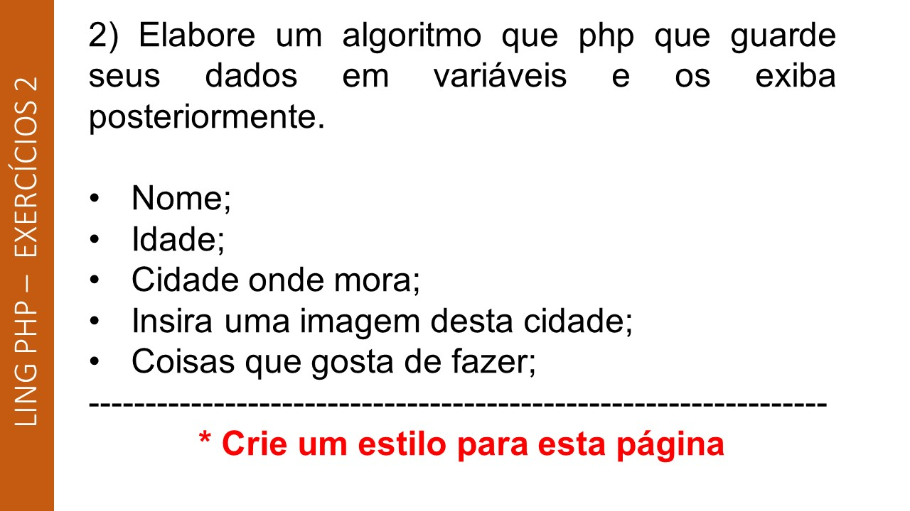
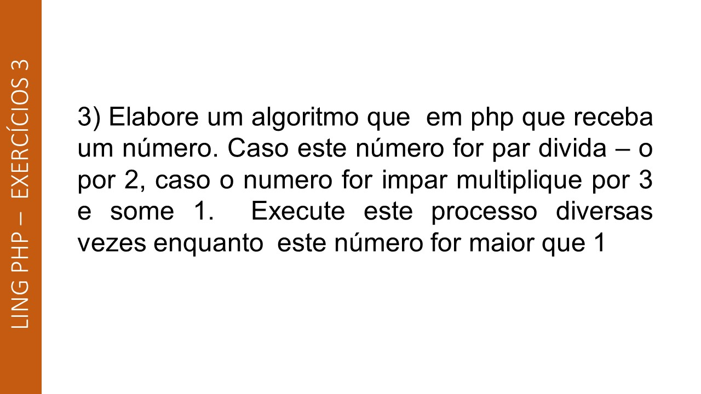
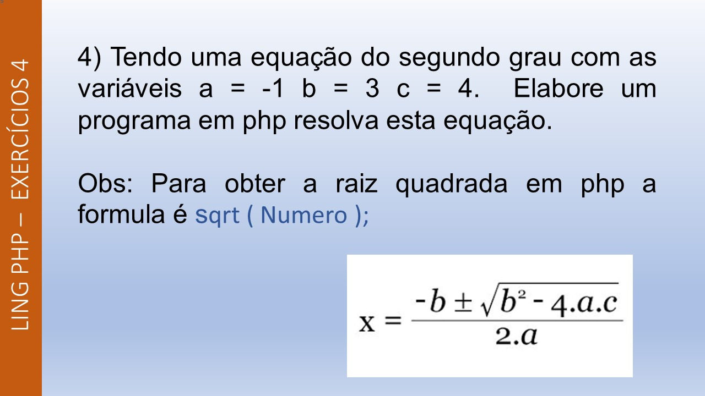
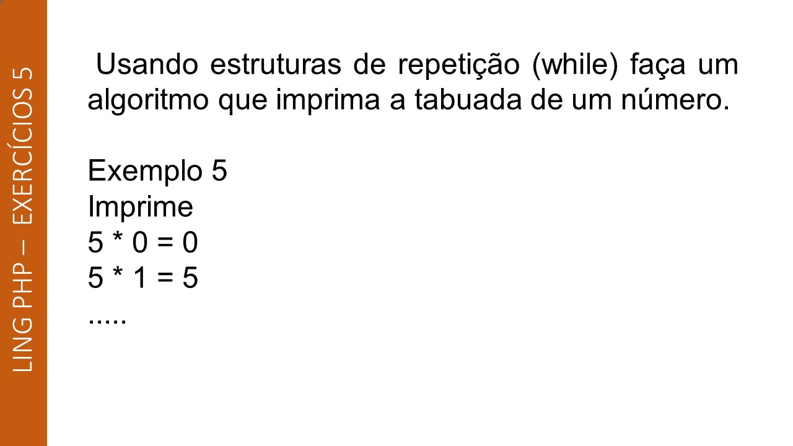
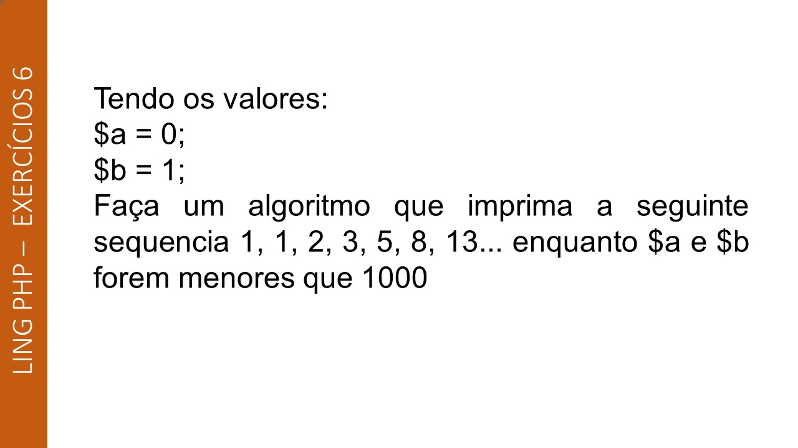
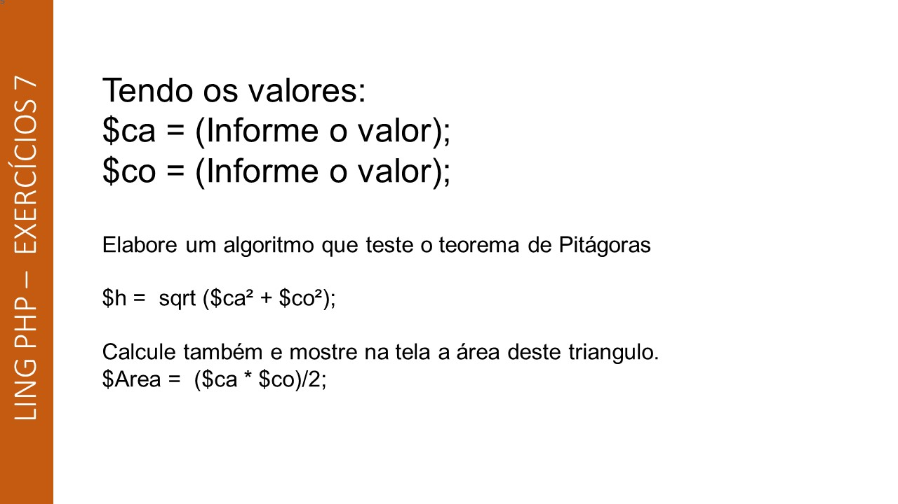
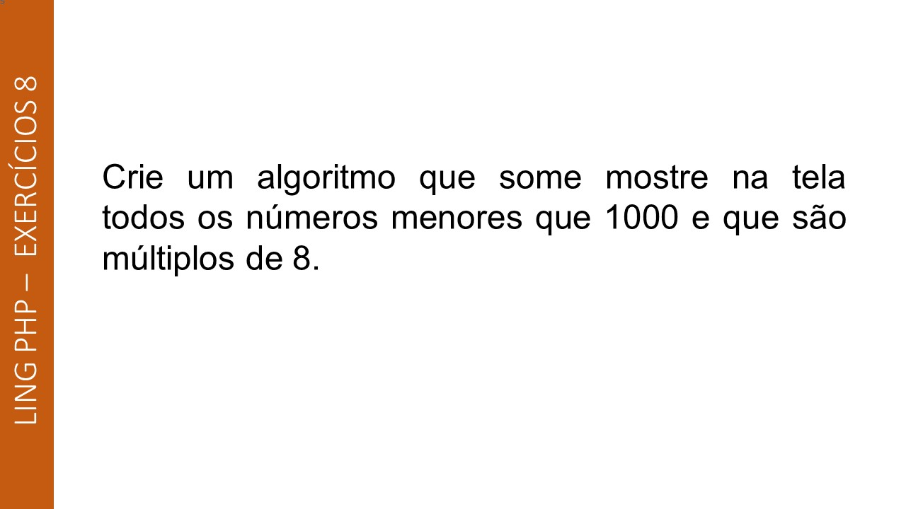

# PHP-Exercises-2
More exercises to the course Programming language of Computer technician from Colégio Estadual do Paraná

## Slide2

    

## Slide3

    

## Slide4

    

## Slide5

    

## Slide6

    

## Slide7

    

## Slide8

    

## Slide9

    

